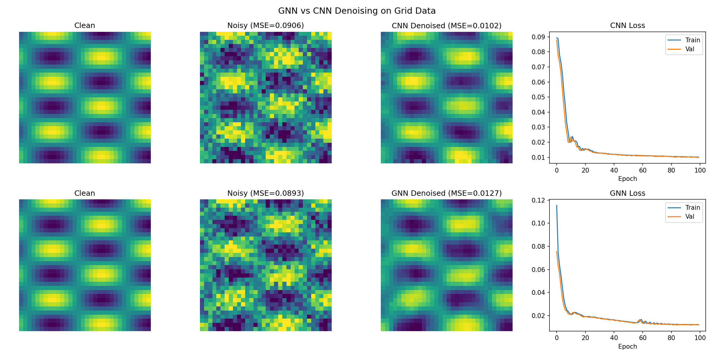

# Graph Deep Fakes for Mesh Simulations

Generate synthetic graph signals on meshes using GNN-based diffusion models. Train on simulation data (e.g., cloth/flag dynamics) and generate new realistic samples or augment existing ones.

## Overview

This project trains a diffusion model to generate "deep fake" mesh signals. The approach:

1. **Custom Simulation**: GPU-accelerated cloth simulation generates statistically independent training frames
2. **Single-Frame Training**: Treat each simulation frame as an independent graph signal (V vertices × 3 coords)
3. **GNN Encoder/Decoder**: Message-passing networks with edge features for direction-aware processing
4. **DDPM Diffusion**: Standard denoising diffusion with cosine noise schedule
5. **Augmentation**: Generate variations of real signals via partial denoising

## Why Custom Simulation?

The original DeepMind dataset contains sequential video frames that are highly correlated (consecutive frames are nearly identical). This causes problems for diffusion model training:

- Two nearly identical frames must map to completely different noise patterns
- The model struggles to learn a coherent noise→signal mapping
- Generation from pure noise (step 999) fails to produce useful signals

**Solution**: Generate training data with large temporal stride (e.g., 100 steps between frames) so each training sample is statistically independent.

## Quick Start

### Windows (GPU)

```cmd
git clone git@github.com:drhalftone/LAUGraphDeepFakes.git
cd LAUGraphDeepFakes

:: Setup environment
setup_gpu.bat

:: Generate training data (statistically independent frames)
run_simulation.bat

:: Train diffusion model
python train_flag_diffusion.py
```

### Linux (GPU)

```bash
git clone git@github.com:drhalftone/LAUGraphDeepFakes.git
cd LAUGraphDeepFakes
chmod +x setup_gpu.sh && ./setup_gpu.sh
source gdf_env/bin/activate

# Generate training data
python simulate_flag.py --record --stride 100 --frames 100000

# Train
python train_flag_diffusion.py
```

The setup script:
- Creates virtual environment `gdf_env`
- Installs PyTorch with CUDA, torch-geometric, TensorFlow
- Downloads ~1GB flag simulation data (mesh only)

Skips any steps already completed (safe to re-run).

## Flag Simulation

GPU-accelerated cloth simulation using position-based dynamics (PyTorch + CUDA).

### Preview Mode
```bash
python simulate_flag.py
```
Opens interactive 3D visualization of the waving flag.

### Record Training Data
```bash
python simulate_flag.py --record --stride 100 --frames 100000
```

| Argument | Default | Description |
|----------|---------|-------------|
| `--record` | False | Enable recording mode |
| `--stride` | 100 | Save every Nth frame (ensures independence) |
| `--frames` | 10000 | Total simulation steps |
| `--output` | flag_data | Output directory |

**Example**: `--stride 100 --frames 100000` produces 1000 independent frames.

### Physics Model

- **Position-Based Dynamics**: Stable constraint solving
- **Chaotic Wind**: Multi-frequency sinusoidal gusts + random turbulence
- **Verlet Integration**: Energy-conserving time stepping
- **GPU Acceleration**: All operations vectorized on CUDA

## Requirements

- Python 3.10+
- NVIDIA GPU with CUDA support (recommended)
- ~4GB disk space

## Project Structure

```
LAUGraphDeepFakes/
├── flag_data/                  # Flag simulation data
│   ├── flag_test.npz          # Original mesh (from DeepMind)
│   └── flag_simulated.npz     # Generated training data
├── flag_diffusion_output/      # Training output (models, visualizations)
├── docs/
│   └── graph_signal_diffusion.md  # Detailed architecture docs
├── reports/
│   └── diffusion_for_graph_signals.tex
├── simulate_flag.py           # GPU cloth simulation (PyTorch)
├── train_flag_diffusion.py    # Diffusion model training
├── setup_gpu.bat              # Windows: environment setup
├── run_simulation.bat         # Windows: generate training data
├── setup_gpu.sh               # Linux: environment setup
├── setup_flag_data.py         # Download mesh data
├── experiment_gnn_vs_cnn.py   # GNN vs CNN comparison
└── debug_sim.py               # Simulation debugging utility
```

## Current Approach: Graph Signal Diffusion

See **[docs/graph_signal_diffusion.md](docs/graph_signal_diffusion.md)** for full details.

**Key insight**: Diffusion models support data augmentation by controlling noise injection level - start denoising from an intermediate step to generate signals similar to the original.

### Manual Setup

```bash
# 1. Setup data (downloads ~1GB, converts to numpy)
python setup_flag_data.py

# 2. Train diffusion model (requires GPU)
python train_flag_diffusion.py
```

Output goes to `flag_diffusion_output/`.

## Model Architecture

### GNN Diffusion Model (~534K parameters)

```
Input: noisy frame (V, 3) + noise step n
                ↓
        [Input Projection]
                ↓
        [GNN Encoder × 4 layers]  ←── edge features (direction + length)
                ↓
        [+ Timestep Embedding]
                ↓
        [GNN Decoder × 4 layers]  ←── edge features
                ↓
        [Output Projection]
                ↓
Output: predicted noise (V, 3)
```

### Key Components

| Component | Description |
|-----------|-------------|
| **MeshConv** | Message-passing with edge features `[x_i, x_j, edge_attr]` |
| **Edge features** | Direction vector (dx, dy, dz) + length - enables direction awareness like CNN kernels |
| **Timestep embedding** | Sinusoidal encoding of diffusion step |
| **Residual connections** | Skip connections in encoder/decoder |

### Diffusion

- **Schedule**: Cosine (1000 steps)
- **Training**: Predict noise ε from noisy signal x_n
- **Generation**: Iterative denoising from pure noise
- **Augmentation**: Start from real signal + partial noise

## Output Files

After training, `flag_diffusion_output/` contains:

| File | Description |
|------|-------------|
| `best_model.pt` | Best checkpoint (lowest validation loss) |
| `checkpoint_epoch*.pt` | Periodic checkpoints |
| `training_curves.png` | Loss curves (linear + log scale) |
| `epoch_progression.png` | Generation quality over training |
| `comparison_epoch*.png` | Real vs generated vs augmented |

## Dataset: Flag Simulation

From DeepMind's MeshGraphNets:

| Property | Value |
|----------|-------|
| Trajectories | 100 |
| Frames per trajectory | 401 |
| **Total training samples** | **40,100 frames** |
| Vertices per frame | 1,579 |
| Mesh triangles | 3,028 |
| Data size | ~725 MB (numpy) |

Each frame is treated as an independent sample: `(1579, 3)` vertex positions.

## Training

Default configuration:

| Setting | Value |
|---------|-------|
| Epochs | 100 |
| Batch size | 32 |
| Learning rate | 1e-4 |
| Hidden dim | 128 |
| GNN layers | 4 encoder + 4 decoder |

Expected time on RTX 4070 Ti: **~25-50 minutes**

## GNN vs CNN Comparison

The experiment `experiment_gnn_vs_cnn.py` demonstrates that GNNs can achieve similar denoising quality to CNNs on grid-structured data:

| Model | Denoising MSE | Noise Reduction | Parameters |
|-------|---------------|-----------------|------------|
| CNN   | 0.0102        | 88.8%           | 75,073     |
| GNN   | 0.0127        | 85.8%           | 38,017     |

This validates using GNNs for mesh data: they match CNN quality while generalizing to arbitrary mesh topologies (not just regular grids).



## References

- [DDPM](https://arxiv.org/abs/2006.11239) - Denoising Diffusion Probabilistic Models (Ho et al., 2020)
- [Improved DDPM](https://arxiv.org/abs/2102.09672) - Cosine schedule (Nichol & Dhariwal, 2021)
- [SDEdit](https://arxiv.org/abs/2108.01073) - Partial denoising for augmentation (Meng et al., 2022)
- [MeshGraphNets](https://arxiv.org/abs/2010.03409) - Edge features for mesh processing (Pfaff et al., 2021)
- [GAD](https://arxiv.org/abs/2510.05036) - Graph-Aware Diffusion (alternative approach included for comparison)

See `docs/` for detailed documentation and `reports/` for LaTeX reports.

## License

MIT
